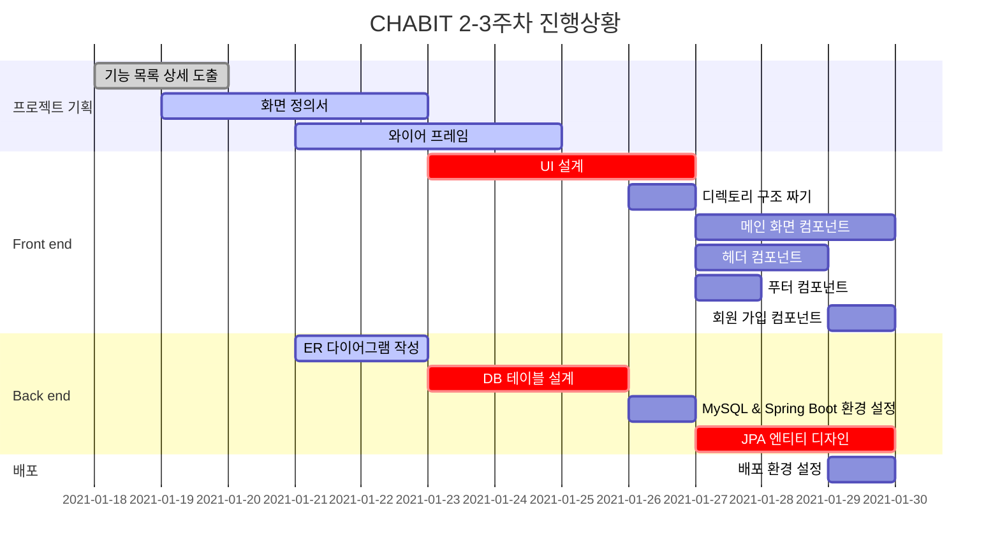

# CHABIT

## 팀소개

- 팀명 : 살찐개
- 팀원 소개  
   팀장 : 김민혁  
   팀원 : 백정현, 이아름, 이동훈, 윤지해
- 역할 분담
  - 기획  
     이아름
  - QA  
     백정현, 윤지해, 이동훈
  - UI/UX 디자이너  
     백정현
  - 테크리더  
     김민혁
  - 프론트  
     이아름, 이동훈, 윤지해
  - 백엔드  
     백정현, 김민혁

## 주제

## 주요 기능

## 실행 화면

## 기술 스택

### Front-end

- HTML, CSS, JS
- Vue.js

### Back-end

- Spring boot
- JAVA
- MySQL : 배포용
- H2 : 개발, 내부 테스트용

### DevOps

- Jira
- Docker
- GitLab
- Jenkins

## 시스템 구성도

## 개발 규칙

### Git

**Commit message**

```
[Jira 이슈 번호] 타이틀: 설명
예시 : [S04P12B207-15]Docs: 커밋 메세지 규칙 수정
```

```
Feat   : 코드나 테스트를 추가했을 때
Fix    : 버그를 수정했을 때
Remove : 코드를 제거했을 때
Update : 코드보다는 문서나 라이브러리 등을 보완했을 때
Docs   : 문서를 수정했을 때
Style  : 코드 포맷팅에 대한 부분 변경, CSS 등
Rename : 이름을 변경했을 때
Move   : 코드를 이동할 때
Refac  : 코드 리팩토링
```

**Branch**

- master
- develop
- feature
  ```
  예시) 로그인 기능의 경우 : feature/login
  ```
- hotfix  
   배포 후 발생한 버그 처리

### Code

- 파스칼 케이스  
   Vue 파일, 컴포넌트 이름
- 케밥 케이스  
   html id, class
- 카멜 케이스  
   method 이름

## 프로젝트 일정

### Gantt chart


