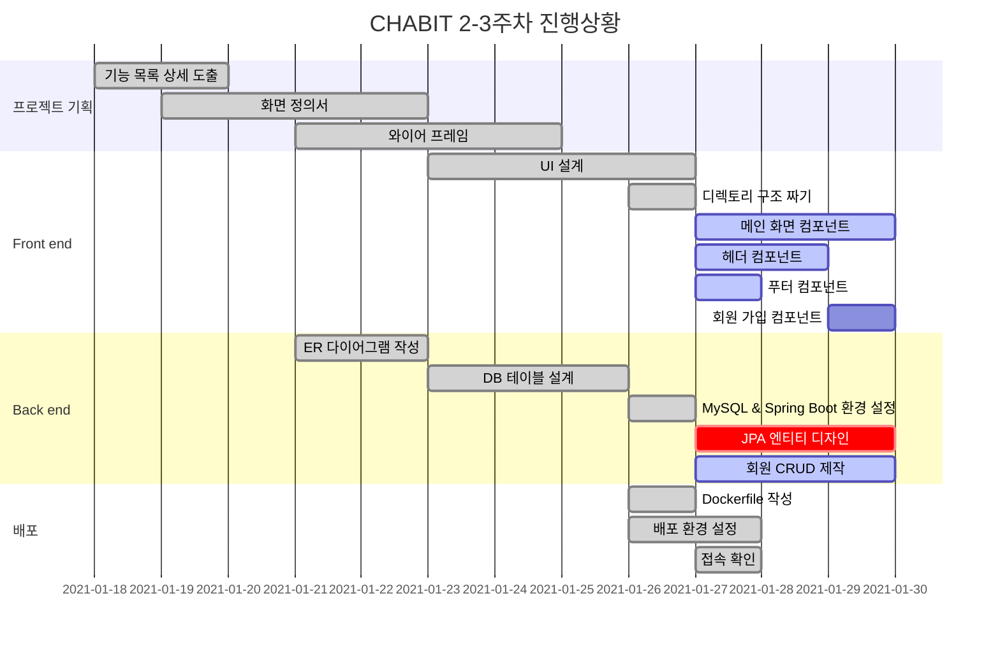
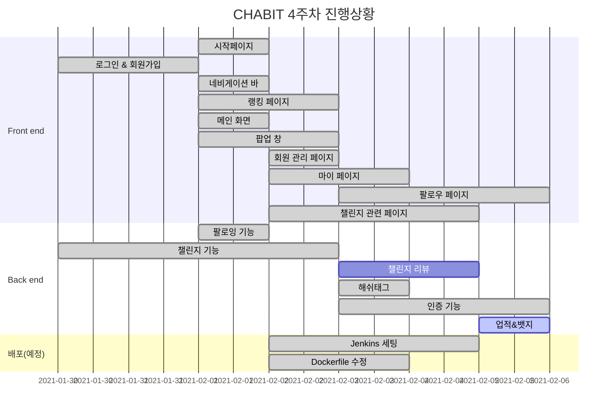
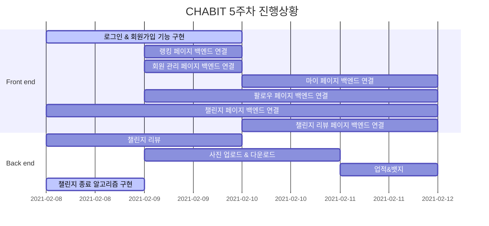
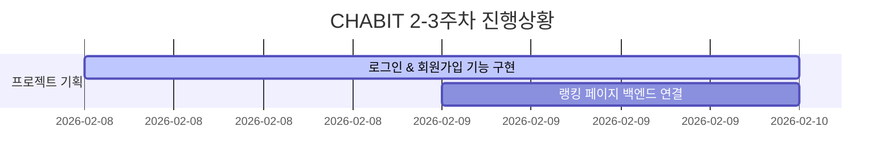

# CHABIT

공통-Sub PJT II 프로젝트를 위한 저장소 입니다.

## 팀소개

- 팀명 : 살찐개
- **참여자**
  - 팀장 : 김민혁
  - 팀원 : 윤지해, 이동훈, 백정현, 이아름
- **역할 분담**
  - **프론트**  
     이아름, 이동훈, 윤지해
  - **백엔드**  
     백정현, 김민혁
  - **QA**  
     백정현, 윤지해, 이동훈
  - **UI/UX 디자이너**  
     백정현
  - **테크리더**  
     김민혁
  - **기획**  
     이아름

## 주제

### CHABIT

- **Challenge to Habit - 새로운 습관에 도전하다.**

## 주요 기능

- 새로운 습관을 만들거나 꾸준함을 목표로 하는 사람들을 위해<br>다른 사람들과 함께 도전 할 수 있는 챌린지를 제공합니다.

- 챌린지 성공 시 인증서와 포인트를 통해 동기부여를 얻습니다.

- 리뷰를 통해 다른 유저들과의 소통과 취미 또는 습관에 대한 공유 기능을 제공합니다.

- 챌린지 인증을 하기 위해 랜덤으로 제시되는 손동작을 함께 올리도록 합니다.

## 실행 화면

## 개발환경

|   분류   |                                        정보                                         |
| :------: | :---------------------------------------------------------------------------------: |
| 운영체제 |                                     Windows 10                                      |
| 개발 툴  | Spring Tools 4.9.0 - WINDOWS 64-BIT<br>IntelliJ IDEA Ultimate<br>Visual Studio Code |
|   JDK    |                                     JAVA 8이상                                      |

## 기술 스택

|    분류    |                          기술                           |
| :--------: | :-----------------------------------------------------: |
| 프론트엔드 |           Vue.js, Vuex <br /> HTML5, CSS3, JS           |
|   백엔드   | Spring Boot <br /> H2 (개발, 테스트) <br /> MySQL(배포) |
|   DevOps   |    Jira, mattermost <br /> GitLab <br /> Docker, AWS    |

## 시스템 구성도


### 디렉토리 구조

**Spring Boot**

```bash
backend
├─ .gitignore
├─ build.gradle
└─ src
   ├─ main
   │  ├─ java
   │  │   └─ chabit
   │  │       ├─ controller
   │  │       ├─ service
   │  │       ├─ repository
   │  │       ├─ domain
   │  │       ├─ config
   │  │       ├─ exception
   │  │       └─ ChabitApplication.java
   │  └─ resources
   │     ├─ application.yml   설정 파일
   │     └─ ...
   └─ test                    테스트 파일

```

**Vue**

```bash
frontend
├─ README.md
├─ package.json
└─ src
   ├─ main.js
   ├─ App.vue
   ├─ components        컴포넌트
   │  ├─ common
   │  ├─ include
   │  └─ user
   │     └─ snsLogin
   │
   ├─ router            라우터
   │  └─ index.js
   │
   ├─ views             라우터 페이지
   │  ├─ challenge
   │  ├─ feed
   │  ├─ follow
   │  ├─ home
   │  ├─ ranking
   │  ├─ setting
   │  └─ user
   │
   ├─ vuex              상태 관리
   │  ├─ actions.js
   │  ├─ getter.js
   │  ├─ mutations.js
   │  └─ store.js
   │
   ├─ api               api 함수
   │  ├─ UserApi.js
   │  └─ ...
   │
   └─ assets            기타 자원
      ├─ css            스타일 시트
      │  ├─ common.css
      │  └─ ...
      ├─ img            이미지
      └─ ...
```

## 개발 규칙

### Git

**Commit message**

```
[Jira 이슈 번호] 타이틀: 설명
예시 : [S04P12B207-15]Docs: 커밋 메세지 규칙 수정
```

```
Feat : 코드나 테스트를 추가했을 때 + 라이브러리 추가하는 경우
Fix : 버그를 수정했을 때
Remove : 코드를 제거했을 때
Update : 코드를 수정하는 경우
Docs : 문서를 수정했을 때
Style : 코드 포맷팅에 대한 부분 변경, CSS 등
Rename : 이름을 변경했을 때
Move : 코드를 이동할 때
Refac : 기능 변화 없이 코드 내부 구조 변경하는 경우
```

**Branch**

- master
- develop
- feature
  ```
  예시) 로그인 기능의 경우 : feature/login
  ```
- hotfix  
   배포 후 발생한 버그 처리

### Code

- 파스칼 케이스  
   Vue 파일, 컴포넌트 이름
- 케밥 케이스  
   html id, class
- 카멜 케이스  
   method 이름

## 프로젝트 일정

### Gantt chart

**Sub Project2**



**Sub Project3**






