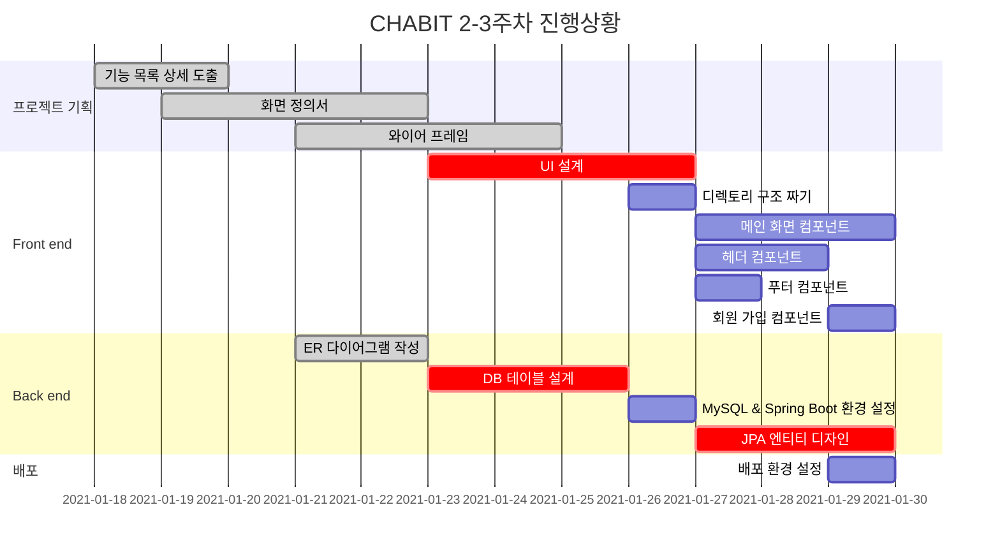

# CHABIT

공통-Sub PJT II 프로젝트를 위한 저장소 입니다.

## 팀소개

- 팀명 : 살찐개
- **참여자**
  - 팀장 : 김민혁
  - 팀원 : 윤지해, 이동훈, 백정현, 이아름
- **역할 분담**
  - **프론트**  
     이아름, 이동훈, 윤지해
  - **백엔드**  
     백정현, 김민혁
  - **QA**  
     백정현, 윤지해, 이동훈
  - **UI/UX 디자이너**  
     백정현
  - **테크리더**  
     김민혁
  - **기획**  
     이아름

## 주제

### CHABIT

- **Challenge to Habit - 새로운 습관에 도전하다.**
   
   - 새로운 습관을 만들거나 꾸준함을 목표로 하는 사람들을 위해<br>다른 사람들과 함께 도전 할 수 있는 챌린지를 제공합니다.

   - 챌린지 성공 시 인증서와 포인트를 통해 동기부여를 얻습니다.

   - 리뷰를 통해 다른 유저들과의 소통과 취미 또는 습관에 대한 공유 기능을 제공합니다.

   - 챌린지 인증을 하기 위해 랜덤으로 제시되는 손동작을 함께 올리도록 합니다.

## 주요 기능

## 실행 화면

## 개발환경

|   분류   |                                        정보                                         |
| :------: | :---------------------------------------------------------------------------------: |
| 운영체제 |                                     Windows 10                                      |
| 개발 툴  | Spring Tools 4.9.0 - WINDOWS 64-BIT<br>IntelliJ IDEA Ultimate<br>Visual Studio Code |
|   JDK    |                                     JAVA 8이상                                      |

## 기술 스택

### Front-end

- HTML, CSS, JS
- Vue.js

### Back-end

- Spring boot
- JAVA
- MySQL : 배포용
- H2 : 개발, 내부 테스트용

### DevOps

- Jira
- Docker
- GitLab
- Jenkins

## 시스템 구성도

## 개발 규칙

### Git

**Commit message**

```
[Jira 이슈 번호] 타이틀: 설명
예시 : [S04P12B207-15]Docs: 커밋 메세지 규칙 수정
```

```
Feat   : 코드나 테스트를 추가했을 때
Fix    : 버그를 수정했을 때
Remove : 코드를 제거했을 때
Update : 코드보다는 문서나 라이브러리 등을 보완했을 때
Docs   : 문서를 수정했을 때
Style  : 코드 포맷팅에 대한 부분 변경, CSS 등
Rename : 이름을 변경했을 때
Move   : 코드를 이동할 때
Refac  : 코드 리팩토링
```

**Branch**

- master
- develop
- feature
  ```
  예시) 로그인 기능의 경우 : feature/login
  ```
- hotfix  
   배포 후 발생한 버그 처리

### Code

- 파스칼 케이스  
   Vue 파일, 컴포넌트 이름
- 케밥 케이스  
   html id, class
- 카멜 케이스  
   method 이름

## 프로젝트 일정

### Gantt chart


