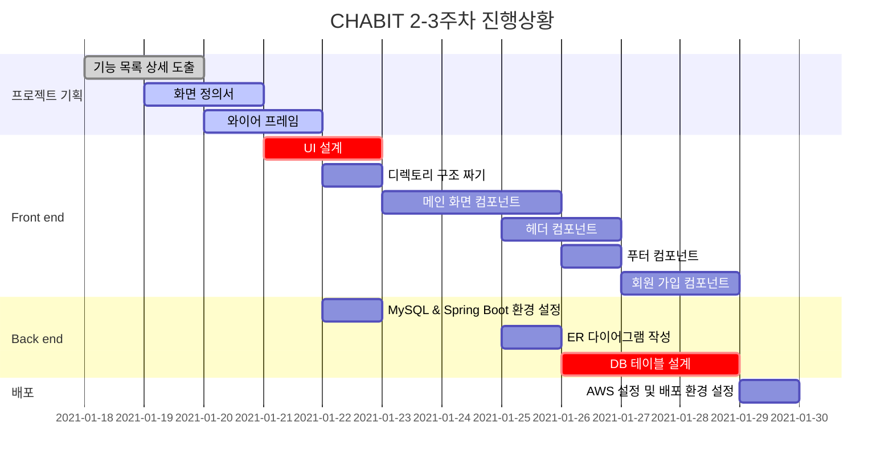

# CHABIT

## 팀소개

- 팀명 : 살찐개
- 팀원 소개  
   팀장 : 김민혁  
   팀원 : 백정현, 이아름, 이동훈, 윤지해

## 주제

## 기술 스택

### Front-end

- Vue.js

### Back-end

- Spring boot
- JAVA
- MySQL

### DevOps

- Jenkins
- Docker
- Gitlab

## 주요 기능

## 개발 규칙

### Git

**Commit message**

```
Feat   : 코드나 테스트를 추가했을 때
Fix    : 버그를 수정했을 때
Remove : 코드를 제거했을 때
Update : 코드보다는 문서나 라이브러리 등을 보완했을 때
Docs   : 문서를 수정했을 때
Style  : 코드 포맷팅에 대한 부분 변경, CSS 등
Rename : 이름을 변경했을 때
Move   : 코드를 이동할 때
Refac  : 코드 리팩토링
```

**Branch**

- master
- develop
- feature
  ```
  예시) 로그인 기능의 경우 : feature/login
  ```

### Code

- 파스칼 케이스  
   Vue 파일, 컴포넌트 이름
- 케밥 케이스  
   html id, class
- 카멜 케이스  
   method 이름

## 프로젝트 일정

### Gantt chart


